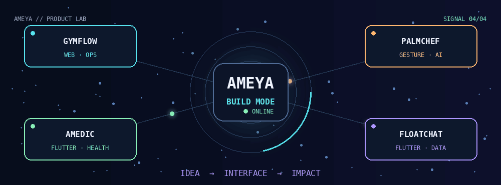
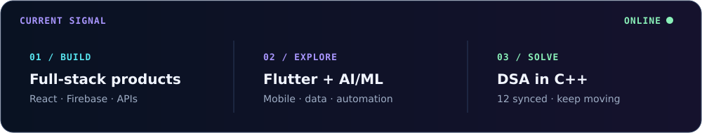

<div align="center">




<a href="https://github.com/Ameya5006"></a>
<a href="https://boxingguruji.vercel.app/"></a>
<a href="https://palmchef-14qa.onrender.com"></a>

</div>

---

## `// identity`

```yaml
name: Ameya
base: Bennett University · B.Tech CSE
builds: [web, mobile, useful automation]
current_mode: learn → build → ship → repeat
```



---

## `// tech_deck`

<p align="center">
  <br/>
  <br/>
  
</p>

<p align="center"><code>Gemini</code> · <code>MediaPipe</code> · <code>Firestore</code> · <code>Google Sheets API</code> · <code>Apps Script</code> · <code>JWT</code> · <code>REST APIs</code> · <code>WhatsApp</code> · <code>UPI</code></p>

<details>
<summary><strong>Open the utility drawer</strong></summary>

`React 18/19` · `TypeScript 5/6` · `Vite 7/8` · `React Router` · `Framer Motion` · `Zustand` · `Mongoose` · `bcrypt.js` · `CORS` · `Zod` · `PDF.js` · `Web Speech API` · `Vitest` · `React Testing Library` · `ESLint` · `Prettier` · `PostCSS` · `Nodemon` · `fl_chart` · `pedometer` · `share_plus` · `flutter_map` · `latlong2` · `Flutter animations` · `Render`

</details>

---

## `// project_launchpad`

### `01` 🥊 [GymFlow](https://github.com/Ameya5006/Dual-gym-website) · [Live ↗](https://boxingguruji.vercel.app/)
Two gyms, one production platform—memberships, admin dashboards, Sheets sync, WhatsApp reminders and UPI.  
`React 19` `TypeScript 6` `Firebase` `Apps Script` `Vercel`

### `02` 🍳 [PalmChef](https://github.com/Ameya5006/PalmChef) · [Live ↗](https://palmchef-14qa.onrender.com)
Cooking without touching the screen—hand gestures, spoken recipes, timers and offline PWA support.  
`React 18` `MediaPipe` `Gemini` `MongoDB` `Docker`

### `03` ❤️ [Amedic](https://github.com/Ameya5006/Amedic)
A pocket health dashboard for steps, goals, BMI/BMR, sleep, nutrition and shareable summaries.  
`Flutter` `Dart` `pedometer` `fl_chart` `share_plus`

### `04` 🌊 [FloatChat / ARGO Mobile](https://github.com/Ameya5006/FloatChat_app)
An ocean-data explorer with ARGO maps, profiles, alerts, downloads and a conversational demo.  
`Flutter` `Dart` `flutter_map` `latlong2`

<p align="center"><sub>🧪 More experiments brewing: <a href="https://github.com/Ameya5006/Mechyx">Mechyx</a> · <a href="https://github.com/Ameya5006/Kyora">Kyora</a></sub></p>

---

## `// activity_feed`

<p align="center">
  
</p>

<p align="center">
  <a href="https://github.com/Ameya5006/neetcode-submissions"></a>
  
</p>

<p align="center"><sub>C++ · arrays · hashing · binary search · sorting · snapshot verified 5 Sep 2026</sub></p>

---

<div align="center">

### `connection_port: open`

Open to projects, learning opportunities and interesting ideas.

<a href="https://github.com/Ameya5006"></a>


<br/><br/>

*Signal received. Time to build something useful.* ⚡

</div>
