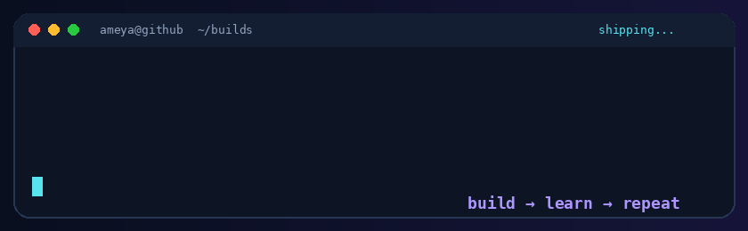

# Ameya
**B.Tech CSE @ Bennett University · Full-Stack & Flutter Developer · AI/ML Explorer**

  

  

---

## About Me

I build practical **web and mobile products**—from clean interfaces to APIs, authentication, databases and deployment. Currently exploring **AI/ML**, sharpening my **C++ problem-solving**, and trying to make useful software feel a little magical.

---

## Tech Stack

   
   
  

  <code>REST APIs</code> · <code>Firestore</code> · <code>JWT</code> · <code>Gemini API</code> · <code>MediaPipe</code> · <code>Google Sheets API</code> · <code>Apps Script</code> · <code>WhatsApp API</code> · <code>UPI</code>

<strong>Libraries & tools I have worked with</strong>

`React 18/19` · `TypeScript 5/6` · `Vite 7/8` · `React Router` · `Framer Motion` · `Zustand` · `Mongoose` · `bcrypt.js` · `CORS` · `Zod` · `PDF.js` · `Web Speech API` · `Vitest` · `React Testing Library` · `ESLint` · `Prettier` · `PostCSS` · `Nodemon` · `fl_chart` · `pedometer` · `share_plus` · `flutter_map` · `latlong2` · `Flutter animations` · `Render`

---

## GitHub Analytics

  

  

---

## Featured Projects

### 🥊 [GymFlow](https://github.com/Ameya5006/Dual-gym-website)
Production membership platform for **Fitness First Boxing Club** and **Nisha Fitness**—dual admin dashboards, Firestore, Sheets sync, WhatsApp reminders and UPI payments.  
`React 19` · `TypeScript 6` · `Firebase` · `Google Apps Script` · `Vercel` · [Live ↗](https://boxingguruji.vercel.app/)

### 🍳 [PalmChef](https://github.com/Ameya5006/PalmChef)
Hands-free kitchen assistant with gesture navigation, spoken recipes, smart timers, PDF/web recipes and offline PWA support.  
`React 18` · `MediaPipe` · `Gemini API` · `MongoDB` · `Docker` · [Live ↗](https://palmchef-14qa.onrender.com)

### ❤️ [Amedic](https://github.com/Ameya5006/Amedic)
Flutter health tracker for steps, goals, BMI/BMR, sleep, nutrition and shareable wellness summaries.  
`Flutter` · `Dart` · `pedometer` · `fl_chart` · `share_plus`

### 🌊 [FloatChat / ARGO Mobile](https://github.com/Ameya5006/FloatChat_app)
Ocean-data explorer with ARGO float maps, profiles, alerts, downloads and a demo conversational interface.  
`Flutter` · `Dart` · `flutter_map` · `latlong2`

**More experiments brewing:** [Mechyx](https://github.com/Ameya5006/Mechyx) · [Kyora](https://github.com/Ameya5006/Kyora)

---

## DSA & Problem Solving

**12 NeetCode problems synced** · **3-day verified submission streak** · Mostly solving in **C++**  
[Browse my solutions ↗](https://github.com/Ameya5006/neetcode-submissions)

Repository snapshot verified 5 September 2026. Platform totals may be higher.

---

## Connect

  
  

---

🌊 *Building useful things—one slightly over-engineered idea at a time.*
