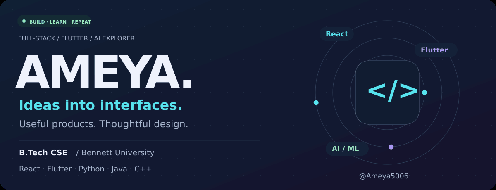
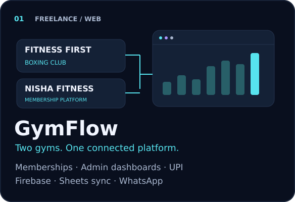
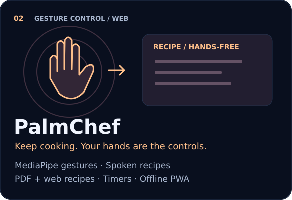
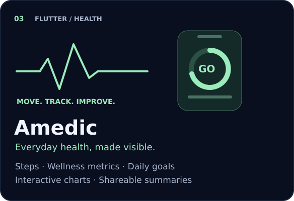
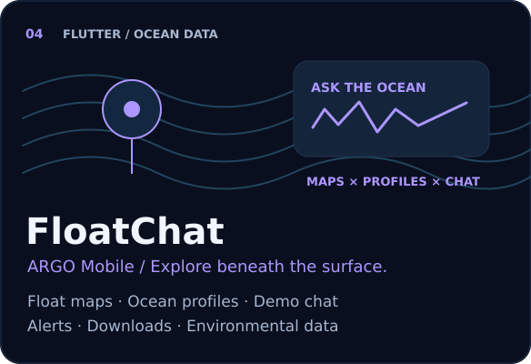
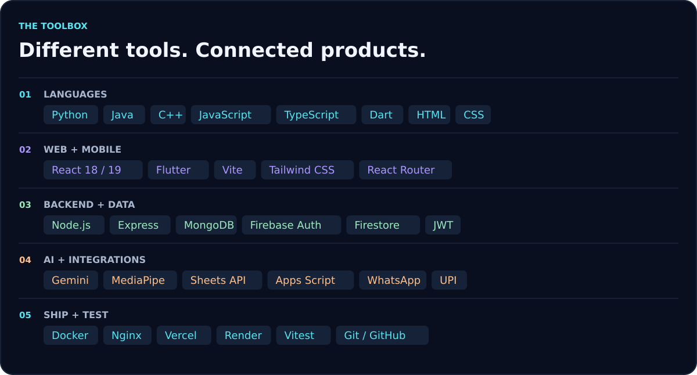
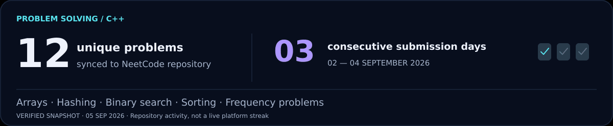
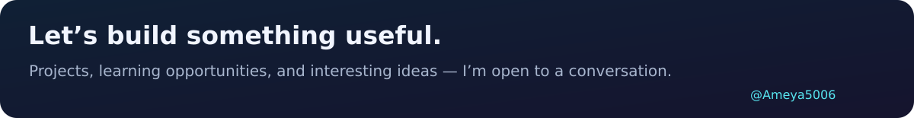

  

  <a href="#selected-builds">Selected builds</a> &nbsp; / &nbsp;
  <a href="#my-toolbox">My toolbox</a> &nbsp; / &nbsp;
  <a href="#problem-solving">Problem solving</a> &nbsp; / &nbsp;
  <a href="#lets-connect">Let's connect</a>

  I'm <strong>Ameya</strong>, a <strong>B.Tech CSE student at Bennett University</strong>. 
  I build web and mobile products — from interfaces and APIs to authentication, databases and deployment. 
  Currently learning <strong>AI/ML</strong>, sharpening my <strong>C++ problem solving</strong>, and building with <strong>React + Flutter</strong>.

 

## Selected builds

<table>
<tr>
<td width="50%" valign="top">
  
  
<strong>A freelance platform for Fitness First Boxing Club and Nisha Fitness</strong>, replacing pen-and-paper membership management.

  
<a href="https://boxingguruji.vercel.app/">Live platform ↗</a> &nbsp; · &nbsp; <a href="https://github.com/Ameya5006/Dual-gym-website">Source code ↗</a>

</td>
<td width="50%" valign="top">
  
  
<strong>A hands-free cooking companion</strong> with gesture navigation, spoken recipe guidance and smart timers.

  
<a href="https://palmchef-14qa.onrender.com">Live app ↗</a> &nbsp; · &nbsp; <a href="https://github.com/Ameya5006/PalmChef">Source code ↗</a>

</td>
</tr>
<tr>
<td width="50%" valign="top">
  
  
<strong>A cross-platform Flutter health tracker</strong> combining daily activity, wellness calculations and interactive visualizations.

  
<a href="https://github.com/Ameya5006/Amedic">Explore Amedic ↗</a>

</td>
<td width="50%" valign="top">
  
  
<strong>A Flutter explorer for ARGO ocean-float data</strong>, combining interactive maps, ocean profiles and a demo conversational interface.

  
<a href="https://github.com/Ameya5006/FloatChat_app">Explore FloatChat ↗</a>

</td>
</tr>
</table>

<strong>Under the hood — features &amp; stack for all four projects</strong>

### GymFlow · Freelance membership platform

Production use for **Fitness First Boxing Club and Nisha Fitness**. Member registration/login, membership status and renewals; a dual-gym admin dashboard with search, status filters and payment management; Firebase authentication and live Firestore records; automated Google Sheets synchronization; gym-specific WhatsApp notifications and expiry reminders; per-gym UPI QR codes and deep links for GPay, PhonePe and Paytm.

**Stack:** React 19 · TypeScript 6 · Vite 8 · Tailwind CSS · React Router · Firebase Auth · Cloud Firestore · Google Sheets API · Google Apps Script · CallMeBot WhatsApp API · UPI deep links · Vercel.

### PalmChef · Hands-free kitchen assistant

Real-time **MediaPipe hand gestures**, text-to-speech recipe guidance, smart cooking timers, recipes from PDFs and web links, and an installable, offline-ready PWA. **Zustand** handles state; **Vitest + React Testing Library** support testing.

**Stack:** React 18 · TypeScript · Vite · Tailwind CSS · Framer Motion · Zustand · Node.js · Express · MongoDB · Mongoose · JWT · Gemini API · MediaPipe Hands · PDF.js · Web Speech API · Vitest · React Testing Library · Docker · Nginx · Render.

### Amedic · Flutter health tracker

Real-time pedometer steps; **BMI, BMR, calorie, sleep-efficiency and gait calculations**; sleep, nutrition, exercise and goal tracking; interactive health charts; shareable health summaries; a customizable dashboard and light/dark themes.

**Stack:** Flutter · Dart · Material Design widgets · pedometer · fl_chart · animations · flutter_staggered_animations · share_plus.

### FloatChat / ARGO Mobile · Ocean-data explorer

Interactive ocean-float maps and profiles; **demo chat** for natural-language ocean-data questions; alerts, downloads and environmental-data views; responsive Material interface and light/dark themes; Flutter structure for mobile, web and desktop.

**Stack:** Flutter · Dart · Material Design widgets · flutter_map · latlong2.

Also taking shape: <a href="https://github.com/Ameya5006/Mechyx">Mechyx</a> · <a href="https://github.com/Ameya5006/Kyora">Kyora</a>

 

## My toolbox

<strong>Complete stack — languages, frameworks, integrations &amp; libraries</strong>

| Area | Technologies I've worked with |
| :--- | :--- |
| Languages & markup | **Python · Java · C++ · JavaScript · TypeScript · Dart · HTML · CSS** |
| Web & mobile | React **18 / 19** · Flutter · Vite **7 / 8** · TypeScript **5 / 6** · Tailwind CSS · React Router · Framer Motion · Zustand · PWA · Material Design widgets |
| Backend & data | Node.js · Express · MongoDB · Mongoose · Firebase Auth · Cloud Firestore · JWT · REST APIs · bcrypt.js · CORS · Zod |
| AI & integrations | Google Gemini API · MediaPipe Hands · Google Sheets API · Google Apps Script · CallMeBot / WhatsApp API · UPI QR codes & deep links · PDF.js · Web Speech API |
| Flutter packages | pedometer · fl_chart · share_plus · flutter_map · latlong2 · animations · flutter_staggered_animations |
| UI & build | Lucide React · PostCSS · Autoprefixer · Nodemon |
| Quality & testing | Vitest · React Testing Library · jsdom · ESLint · Prettier |
| Deployment & tools | Docker · Nginx · Vercel · Render · Git · GitHub · VS Code |

 

## Problem solving

**C++ practice:** arrays, hashing, binary search, sorting and frequency-based problems.  
[Browse my NeetCode solutions ↗](https://github.com/Ameya5006/neetcode-submissions)

Snapshot verified 5 September 2026: 12 unique problems synced; 3 consecutive submission days, 2–4 September. These are repository figures, not live LeetCode/NeetCode platform statistics.

 

## Let's connect

Building, learning and improving — one project and one problem at a time.

